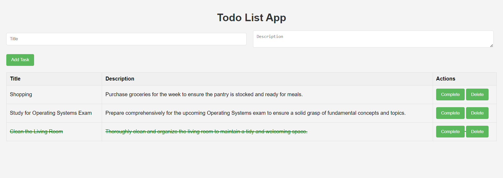

# todo-app-flask-postgresql

This is a simple web application built using Flask, a lightweight web framework in Python, and PostgreSQL, a powerful open-source relational database. The app allows users to manage their tasks with basic functionalities such as adding new tasks, marking tasks as complete, and deleting tasks. It provides a clean and intuitive interface for organizing daily tasks efficiently.



## Prerequisites
Before you begin, ensure you have met the following requirements:

- [Python](https://www.python.org/downloads/)
- [PostgreSQL](https://www.postgresql.org/download/)


### Setting Up the Database

1. Start your PostgreSQL server.
2. Create a new PostgreSQL database for the application.
3. Update the database configuration in `app.py` to match your PostgreSQL settings:

   - DB_HOST: localhost
   - DB_USER: your PostgreSQL username
   - DB_PASSWORD: your PostgreSQL password
   - DB_DATABASE: your database name
   - DB_PORT: your database port

4. Create a table in the database that will be used by your application
   ```
   CREATE TABLE tasks (
   id SERIAL PRIMARY KEY,
   title VARCHAR(255) NOT NULL,
   description TEXT,
   is_complete BOOLEAN DEFAULT false
   );
   ```


## Running App and Database with Docker compose

To run the application using docker compose:

```
docker compose up
```

This will Run both the application and the database containers and will also create a table in the database using the sql script `init.sql`

- Access the application at `http://localhost:5010`.


To take it down run the following command:

```
docker compose down
```

